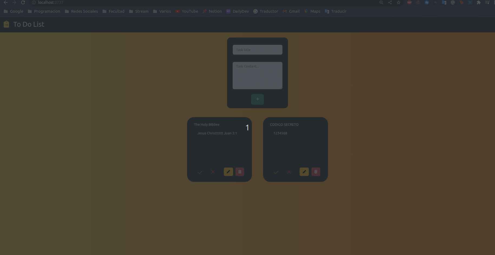
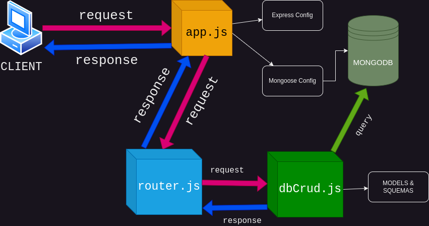

# To Do List | Express - MongoDB Application

This is a simple project for test the basics usage of **MongoDB**, it's build with **NodeJs** and **ExpressJs** and use **EJS** for the server side rendering templates. For the database communication it uses **mongoose package**.

Also it has a `.env` file to configurate the behavior application. At the end of the documentation you can see how to configurate it and what are the enviroment variables.

## How to Use

### Creating a Task


### Editing a Task


### Deleting a Task


### 404 Response


## Requirements

* MongoDB Database

* NodeJs / NPM

## How to Start

Firts of all, you 'll need start the mongod service:

#### Windows

```bash
cd C:\mongodb\bin # navigate to the installation path of your mongodb

mongod.exe
```
#### Ubuntu

```bash
sudo service mongod start
# or
sudo systemctl start mongod
```

Once you started the service you can check if this is running correctly with:


#### Windows

When you start the service you should see the following mesagge

```bash
{"t":{"$date":"2023-05-12T00:00:00.000-04:00"},"s":"I",  "c":"NETWORK",  "id":23016,   "ctx":"listener","msg":"Waiting for connections","attr":{"port":27017,"ssl":"off"}}

```
#### Ubuntu

Use the following command to see the state of `mongod` service, 
```bash
sudo service mongod status
# or
sudo systemctl status mongod
```

You should see the following message:

```bash
 mongod.service - MongoDB Database Server
     Loaded: loaded (/lib/systemd/system/mongod.service; disabled; vendor preset: enabled)
     Active: active (running) since Fri 2023-05-12 13:50:49 -03; 27min ago
       Docs: https://docs.mongodb.org/manual
   Main PID: 13505 (mongod)
     Memory: 231.7M
        CPU: 4.740s
     CGroup: /system.slice/mongod.service
             └─13505 /usr/bin/mongod --config /etc/mongod.conf

may 12 13:50:49 camilo-linux-pc systemd[1]: Started MongoDB Database Server.
```

## Initialize the Application

Once you start the service of mongodb, enter in the project folder and use the following command:

```bash
npm install # For Install the Dependencies (wait to finish)

npm run dev # For Start The App
```

## Application Config

For config the application you 'll need to change the `.env` file, it handles the behavior of the app. Depending of the `NODE_ENV`

```bash
NODE_ENV='dev' # you can change the enviroment ( 'dev' / 'dep' )

SERVER_HOST_DEV='localhost' # you can change the domain where the app deploys in DEVELOPMENT
SERVER_PORT_DEV='3737' # and the port

SERVER_HOST_DEP='localhost' # you can change the domain where the app deploys in PRODUCTION
SERVER_PORT_DEP='3737' # and the port

# Settings to connect with the Database (Development Enviroment)
DB_HOST_DEV="localhost"
DB_NAME_DEV="toDoList"
DB_USER_DEV="admin"
DB_PASS_DEV="admin123"

# Settings to connect with the Database (Production Enviroment)
DB_HOST_DEV=""
DB_NAME_DEV="toDoList"
DB_USER_DEV=""
DB_PASS_DEV=""
```

## Application Diagram

here's a tiny diagram that shows the data flow of the app

